## Repository name
Your repostiory should be named something like `async-final-project-color-name`
Example: `async-final-project-teal-Anas`

## Dataset
[Healthy Minds Network](https://healthymindsnetwork.org/hms/)

## Why did I chose this dataset?
It’s national data on student’s mental health, which is a topic I am interested in.

## Progress
- [X] Picked dataset
- [X] Defined 10 questions
- [X] Answered 10 questions using Pandas
- [X] Added at least one data visualization (using Matplotlib and/or Seaborn) to each single question
- [X] Prepared presentation slides to present at graduation

## Questions
- [X] Question 1: What’s the demographic makeup of my data?
  - I looked at racial background, sex at birth, and gender identities to see the background makeup of the students in my data. It shows a pretty balanced data that is representative of the general population. Although some of the categories are a bit small compared to the sample.
  - Visualization: 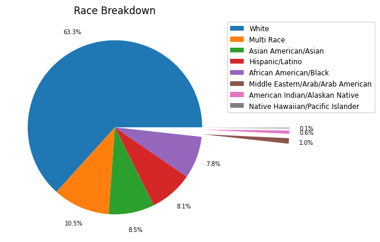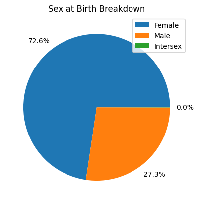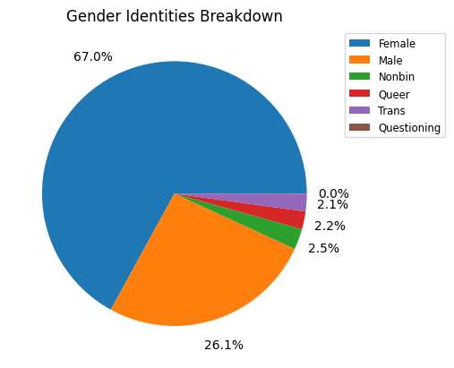

- [X] Question 2: Does student financial status differ between racial groups?
  - Answer: No, the sample shows consistency across both current financial stress as well as financial stress. All groups answered similarly to each other.
  - Visualization: 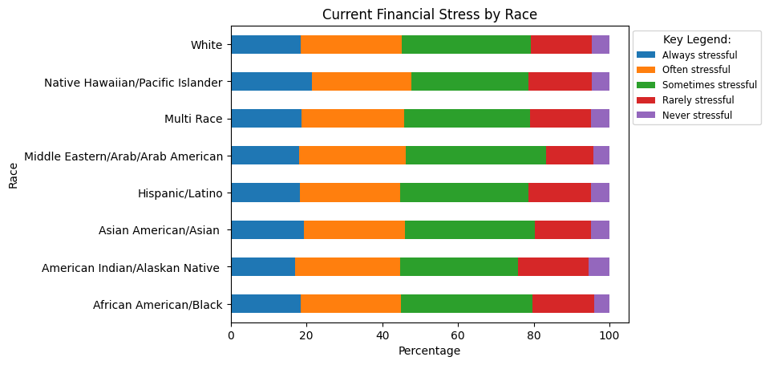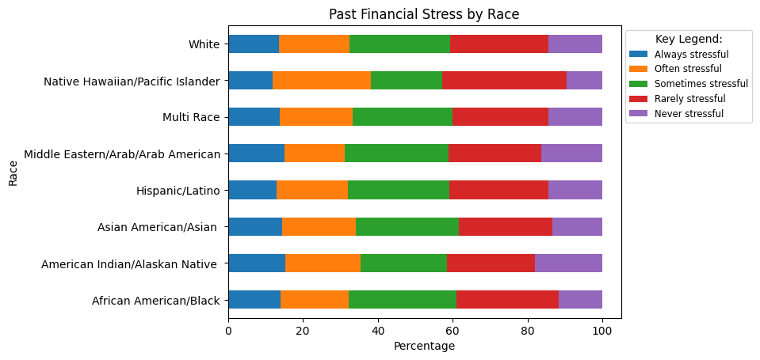

- [X] Question 3: Does student substance use differ between racial groups?
  - Answer: Student substance use is similar across racial groups, except Native Hawaiian/Pacific Islander students are more likely to have used substance in the last thirty days.
  - Visualization: 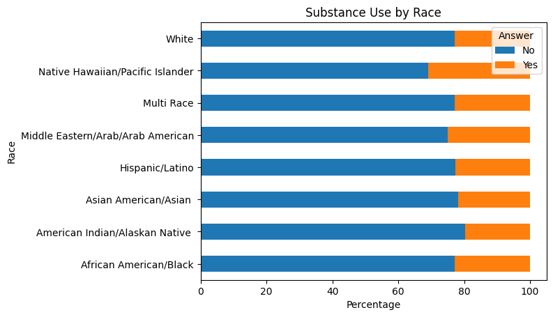

- [X] Question 4: Does mental health wellbeing differ between racial groups?
  - Answer: Yes it differs slightly. Following a similar pattern, Native Hawaiian/Pacific Islander students are more likely to have experienced mental health issues compared to other students, specifially depression episodes seems to be a big factor. Suprisingly, American Indian/Alaskan Native students are less likely to have experienced mental health issues compared to other groups.
  - Visualization: 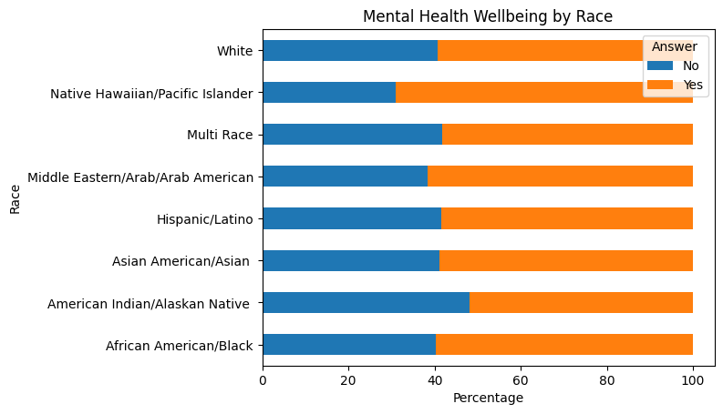 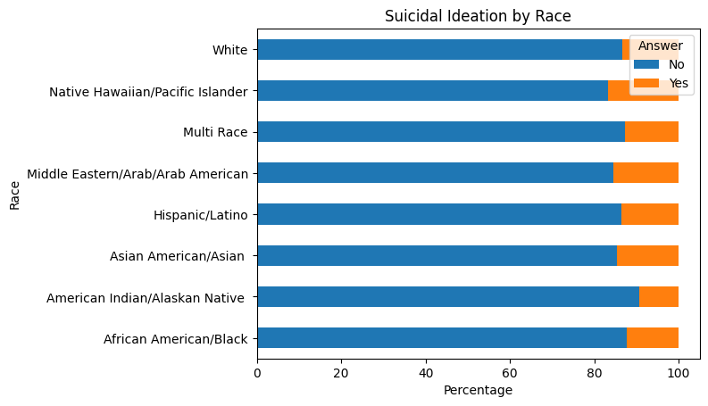 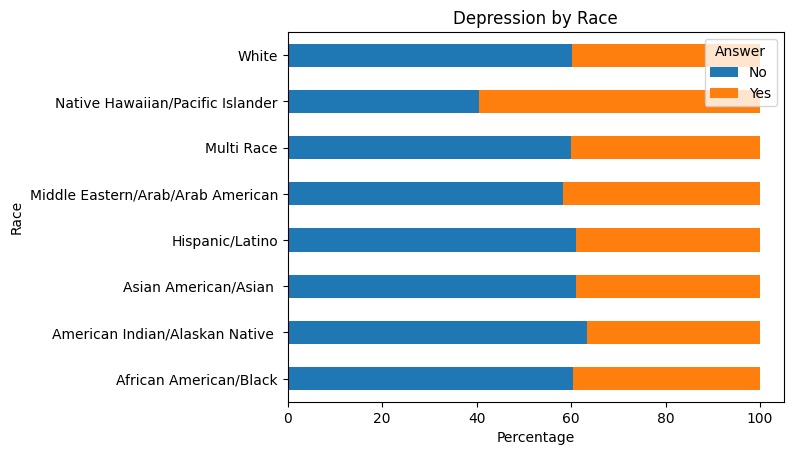 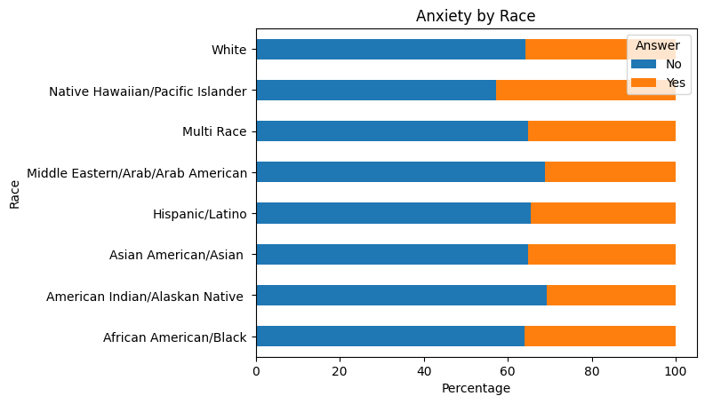

- [X] Question 5: Does mental state about academic performance differ between racial groups?
  - Answer: Yes, following the same pattern as above, Native Hawaiian/Pacific Islander students are more likely to have experienced more days of feeling like their mental health is affecting their academic performance compared to other students. Almost half of the respondents belonging to the Hawaiian/Pacific Islander group answered 6 or more days of feeling like their mental state is affecting their grades.
  - Visualization: 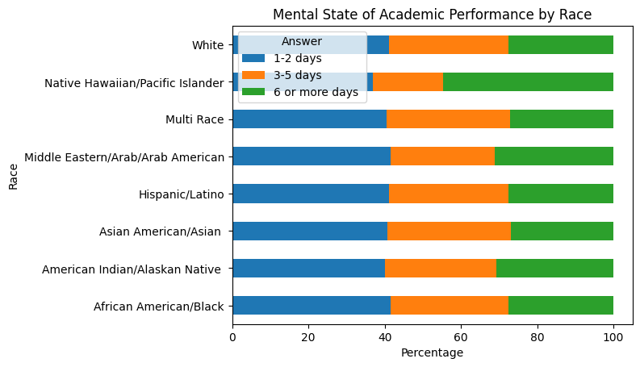

- [X] Question 6: Does current academic performance differ between racial groups?
  - Answer: Yes, following the same pattern as above, Native Hawaiian/Pacific Islander students are less likely to perform well academically compared to other groups.
  - Visualization: 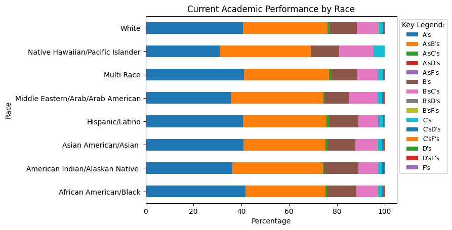

- [X] Question 7: Does knowledge of mental health resources on campus differ between racial groups?
  - Answer: Yes, following the same pattern as above, Native Hawaiian/Pacific Islander students are more likely to have knowledge of the mental health resources offered on their campus compared to other groups.
  - Visualization: 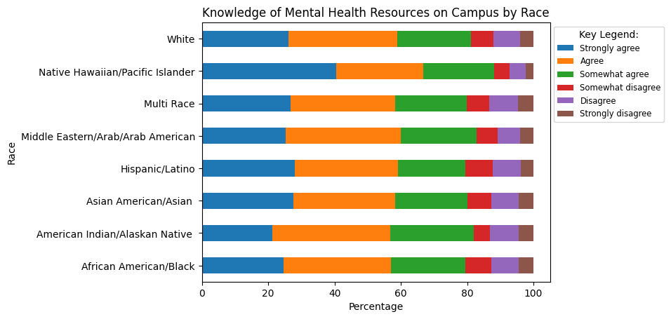

- [X] Question 8: Does mental health stigma differ between racial groups?
  - Answer: No, the sample shows consistency, with the answers across the board. They answered this question: How much do you agree with the following statements? Most people think less of a person who has received mental health treatment.
  - Visualization: 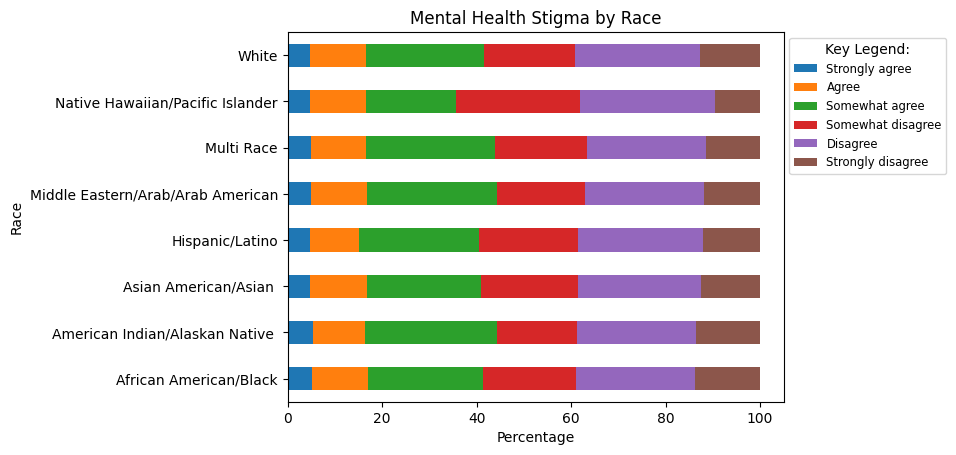

- [X] Question 9: Does therapy usage differ between racial groups?
  - Answer: Yes, therapy usage differs between racial groups. Native Hawaiian/Pacific Islander students are more likely to have used therapy while American Indian/Alaskan Native students are less likely to have used therapy.
  - Visualization: 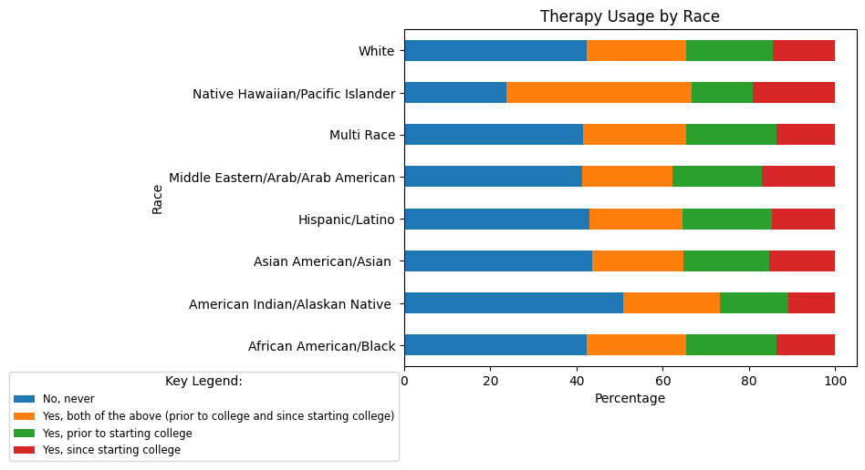

- [X] Question 10: Does self-guided therapy usage differ between racial groups?
  - Answer: No, the sample shows consistency, with the majority of students never tried self-guided therapy apps. All racial groups answered similarly to each other.
  - Visualization: 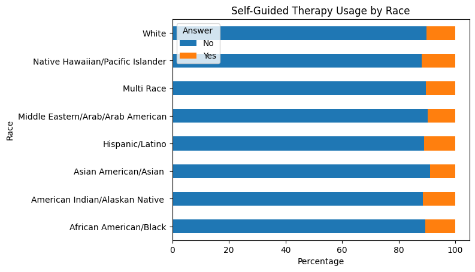
